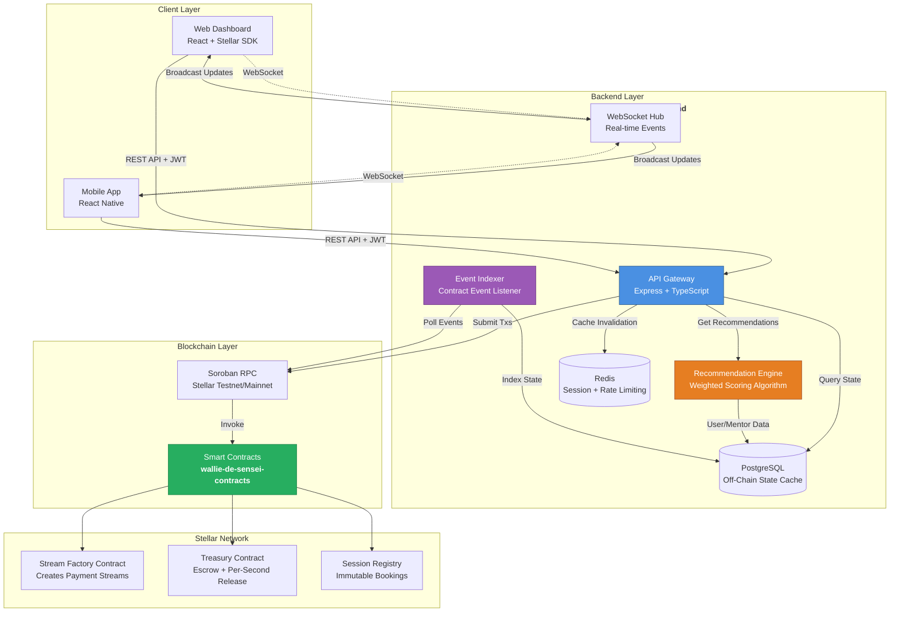
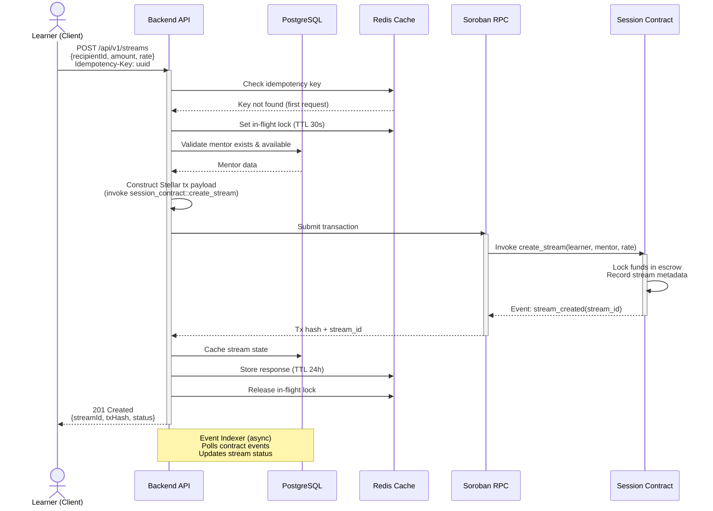

<div align="center">

# 🎓 Wallie de Sensei Backend

**High-Performance API Gateway & Event Indexer for Soroban-Based Mentor Matching**

[](LICENSE)
[](package.json)
[](package.json)
[](https://www.typescriptlang.org/)

[Architecture](#-architecture--system-design) · [Scope of Work](#-repository-scope-of-work) · [Getting Started](#-getting-started) · [API Docs](./API_BEHAVIOR.md) · [Contributing](./CONTRIBUTING.md)

</div>

---

## 📋 Project Overview

**Wallie de Sensei** is a decentralized mentor-learner matching platform built on the **Stellar blockchain** using **Soroban smart contracts**. The platform enables learners to discover, book, and pay for mentorship sessions through treasury streaming—a continuous, real-time payment mechanism enforced entirely on-chain.

### 🎯 Value Proposition

**Problem Solved:**  
Traditional mentorship platforms suffer from high intermediary fees, opaque payment structures, and lack of trust mechanisms. Learners risk upfront payments for undelivered services, while mentors face delayed payouts and platform lock-in.

**Our Solution:**  
Wallie de Sensei eliminates intermediaries by leveraging **Soroban smart contracts** for:
- **Treasury Streaming**: Continuous, per-second payment flows locked in escrow contracts
- **On-Chain Session Verification**: Immutable session commitment records
- **Algorithmic Matching**: Off-chain ML-powered recommendation engine with on-chain payment execution

**Why Stellar?**  
- **Sub-second finality** enables real-time payment streaming
- **Low transaction costs** (~$0.00001 per operation) make micro-transactions viable
- **Soroban smart contracts** provide Rust-level security with WASM execution efficiency

---

## 🏗 Architecture & System Design



### 🔄 Data Flow Explanation

1. **Client → Backend**: Users authenticate via JWT and submit session booking requests
2. **Backend → Contracts**: Backend constructs Stellar transactions and submits to Soroban RPC
3. **Contracts → Blockchain**: Smart contracts execute payment streams and emit events
4. **Blockchain → Indexer**: Event indexer polls contract events and updates PostgreSQL cache
5. **Backend → Client**: WebSocket hub broadcasts real-time state updates to connected clients

---

## 📊 Repository Scope of Work

<table>
<thead>
<tr>
<th>Component / Feature</th>
<th>Backend Responsibility<br/><code>wallie-de-sensei-backend</code></th>
<th>Contract/On-Chain Responsibility<br/><code>wallie-de-sensei-contracts</code></th>
<th>Status</th>
</tr>
</thead>
<tbody>

<tr>
<td><b>User Authentication</b></td>
<td>✅ JWT generation/validation<br/>✅ Password hashing (bcrypt)<br/>✅ Session management</td>
<td>❌ N/A</td>
<td>✅ Done</td>
</tr>

<tr>
<td><b>Mentor Recommendations</b></td>
<td>✅ Weighted scoring algorithm<br/>✅ Skill matching (Jaccard similarity)<br/>✅ Availability filtering<br/>✅ Price fit calculation</td>
<td>❌ N/A (off-chain only)</td>
<td>✅ Done</td>
</tr>

<tr>
<td><b>Session Booking</b></td>
<td>✅ Pre-flight validation<br/>✅ Transaction payload construction<br/>✅ Idempotency key management</td>
<td>✅ On-chain booking registry<br/>✅ Escrow lock enforcement<br/>✅ Timestamp validation</td>
<td>✅ Done</td>
</tr>

<tr>
<td><b>Payment Streaming</b></td>
<td>✅ Stream status caching<br/>✅ Balance query aggregation<br/>✅ Withdrawal transaction construction</td>
<td>✅ Per-second rate calculation<br/>✅ Vested amount enforcement<br/>✅ Early withdrawal penalties</td>
<td>✅ Done</td>
</tr>

<tr>
<td><b>Event Indexing</b></td>
<td>✅ Contract event polling<br/>✅ State synchronization<br/>✅ Cache invalidation</td>
<td>✅ Event emission (stream_created, session_completed, etc.)</td>
<td>🚧 In Progress</td>
</tr>

<tr>
<td><b>Real-Time Updates</b></td>
<td>✅ WebSocket server<br/>✅ Client subscription management<br/>✅ Event broadcasting</td>
<td>❌ N/A</td>
<td>✅ Done</td>
</tr>

<tr>
<td><b>Rate Limiting</b></td>
<td>✅ Per-IP throttling<br/>✅ Redis-backed rate tracking<br/>✅ Endpoint-specific limits</td>
<td>❌ N/A</td>
<td>✅ Done</td>
</tr>

<tr>
<td><b>Idempotency</b></td>
<td>✅ UUID v4 key validation<br/>✅ 24-hour response caching<br/>✅ Concurrent request detection</td>
<td>❌ N/A (handled off-chain)</td>
<td>✅ Done</td>
</tr>

<tr>
<td><b>Analytics</b></td>
<td>✅ Recommendation event logging<br/>✅ Click-through tracking<br/>✅ Dismissal tracking</td>
<td>❌ N/A</td>
<td>✅ Done</td>
</tr>

</tbody>
</table>

---

## 🔁 System Sequence Flow

### Example: Learner Books a Mentorship Session



---

## 🛠 Tech Stack & System Decisions

### Core Technologies

| Layer | Technology | Justification |
|-------|-----------|---------------|
| **Runtime** | Node.js 18+ | Native async/await, excellent Stellar SDK support, high I/O throughput |
| **Language** | TypeScript 5.3 | Static typing prevents runtime errors, superior IDE support for contract ABIs |
| **Framework** | Express.js | Minimal overhead, proven stability, extensive middleware ecosystem |
| **Database** | PostgreSQL 14+ | ACID guarantees for financial data, JSON column support for flexible schema |
| **Cache** | Redis 6+ | Sub-millisecond latency for rate limiting, idempotency keys, session storage |
| **ORM** | TypeORM | Type-safe queries, automatic migrations, strong PostgreSQL feature support |
| **Testing** | Jest + Supertest | Industry standard, 95% coverage enforcement, excellent TypeScript integration |

### Key Design Decisions

#### 1. **Hybrid Architecture (Off-Chain + On-Chain)**
- **Problem**: Soroban contract invocations cost gas; on-chain storage is expensive
- **Solution**: Store ephemeral data (recommendations, analytics) off-chain; only persist financial transactions on-chain
- **Trade-off**: Centralized backend introduces a trust boundary, mitigated by open-sourcing and verifiable state reconstruction

#### 2. **Idempotency via Redis**
- **Problem**: Network failures cause clients to retry requests, risking duplicate payments
- **Solution**: Enforce UUID v4 idempotency keys with 24-hour Redis caching
- **Benefit**: Safe retries without double-spending, concurrent request detection via in-flight locks

#### 3. **Weighted Recommendation Algorithm**
- **Problem**: Simple filtering insufficient for quality mentor matches
- **Solution**: Multi-factor scoring (40% skill match, 30% rating, 20% availability, 10% price fit)
- **Benefit**: Personalized recommendations without on-chain computation overhead

#### 4. **WebSocket Broadcasting for Real-Time UX**
- **Problem**: Polling Soroban RPC for state changes is inefficient
- **Solution**: Backend polls once per interval, broadcasts updates to all connected clients via WebSocket
- **Benefit**: ~100x reduction in RPC calls, sub-second UI updates

---

## 🚀 Getting Started

### Prerequisites

Ensure the following are installed:

```bash
node --version    # v18.0.0 or higher
psql --version    # PostgreSQL 14+
redis-cli --version  # Redis 6+
```

### Installation

```bash
# Clone the repository
git clone https://github.com/wallie-de-sensei/wallie-de-sensei-backend.git
cd wallie-de-sensei-backend

# Install dependencies
npm install
```

### Environment Configuration

Copy the example environment file and configure:

```bash
cp .env.example .env
```

**Required Environment Variables:**

```env
# ============================================
# Server Configuration
# ============================================
NODE_ENV=development
PORT=3000
LOG_LEVEL=info

# ============================================
# Database (PostgreSQL)
# ============================================
DB_HOST=localhost
DB_PORT=5432
DB_USERNAME=postgres
DB_PASSWORD=your_secure_password
DB_DATABASE=wallie_de_sensei
DB_LOGGING=false

# ============================================
# Redis Cache
# ============================================
USE_REDIS=true
REDIS_URL=redis://localhost:6379

# ============================================
# JWT Authentication
# ============================================
# Generate: node -e "console.log(require('crypto').randomBytes(64).toString('hex'))"
JWT_SECRET=your_256_bit_secret_key_here
JWT_EXPIRES_IN=7d

# ============================================
# CORS Configuration
# ============================================
CORS_ORIGIN=http://localhost:3000
```

### Database Setup

Run migrations to create tables:

```bash
npm run migrate
```

### Running the Server

#### Development Mode (Hot Reload)

```bash
npm run dev
```

Server starts at `http://localhost:3000`

#### Production Mode

```bash
# Build TypeScript to JavaScript
npm run build

# Start production server
npm start
```

### Verification

Test the health endpoint:

```bash
curl http://localhost:3000/health
```

Expected response:
```json
{
  "status": "ok",
  "timestamp": "2026-07-15T10:30:00.000Z"
}
```

---

## 🧪 Testing

### Run All Tests

```bash
npm test
```

### Run with Coverage Report

```bash
npm run test:coverage
```

### Coverage Thresholds

The project enforces **95% minimum coverage** across:
- Branches
- Functions
- Lines
- Statements

Tests are organized by layer:
```
tests/
├── middleware/       # Auth, validation, rate limiting
├── routes/           # API endpoint integration tests
├── utils/            # Response helpers, error handlers
├── websocket.test.ts # WebSocket connection tests
└── ws.test.ts        # WebSocket hub tests
```

---

## 📡 API Documentation

### Quick Reference

| Endpoint | Method | Description | Auth Required |
|----------|--------|-------------|---------------|
| `/health` | GET | Health check | ❌ |
| `/api/v1/users/register` | POST | User registration | ❌ |
| `/api/v1/users/login` | POST | Authenticate user | ❌ |
| `/api/v1/streams` | POST | Create payment stream | ✅ |
| `/api/v1/streams` | GET | List user's streams | ✅ |
| `/api/v1/streams/:id` | GET | Get stream details | ✅ |

### Detailed Documentation

- **[API_BEHAVIOR.md](./API_BEHAVIOR.md)** - Idempotency, error codes, rate limits
- **[openapi.yaml](./openapi.yaml)** - Full OpenAPI 3.1 specification

### Example: Create a Payment Stream

```bash
curl -X POST http://localhost:3000/api/v1/streams \
  -H "Authorization: Bearer YOUR_JWT_TOKEN" \
  -H "Content-Type: application/json" \
  -H "Idempotency-Key: 550e8400-e29b-41d4-a716-446655440000" \
  -d '{
    "recipientId": "a1b2c3d4-e5f6-4789-abcd-ef0123456789",
    "depositAmount": "1000000",
    "ratePerSecond": "100",
    "startTime": 1700000000,
    "endTime": 1700010000
  }'
```

---

## 📂 Project Structure

```
wallie-de-sensei-backend/
├── src/
│   ├── config/                 # Database, environment configuration
│   ├── controllers/            # Request handlers
│   │   ├── recommendation.controller.ts
│   │   └── user.controller.ts
│   ├── middleware/             # Express middleware
│   │   ├── auth.middleware.ts
│   │   ├── validation.middleware.ts
│   │   └── requestProtection.ts
│   ├── models/                 # TypeORM entities
│   │   ├── User.ts
│   │   ├── Mentor.ts
│   │   ├── Session.ts
│   │   └── RecommendationEvent.ts
│   ├── routes/                 # API route definitions
│   │   ├── users.routes.ts
│   │   ├── streams.ts
│   │   └── health.routes.ts
│   ├── services/               # Business logic
│   │   └── recommendation.service.ts
│   ├── utils/                  # Shared utilities
│   │   ├── cache.ts            # Redis wrapper
│   │   ├── errors.ts           # Custom error classes
│   │   ├── logger.ts           # Winston logger
│   │   └── response.ts         # Standardized API responses
│   ├── websockets/             # WebSocket handlers
│   │   └── streamChannel.ts
│   ├── ws/                     # WebSocket hub
│   │   └── hub.ts
│   └── index.ts                # Application entry point
├── tests/                      # Test suites
├── database/
│   └── migrations/             # SQL migration files
├── openapi.yaml                # API specification
├── API_BEHAVIOR.md             # Detailed API documentation
├── CONTRIBUTING.md             # Contribution guidelines
├── CODE_OF_CONDUCT.md          # Community standards
├── SECURITY.md                 # Security policy
├── plan.md                     # Wave Program contribution plan
├── package.json
├── tsconfig.json
└── README.md
```

---

## 🔒 Security Features

- ✅ **Helmet.js** - HTTP security headers (XSS, MIME sniffing, clickjacking protection)
- ✅ **CORS** - Configurable origin whitelisting
- ✅ **Rate Limiting** - Per-IP throttling (15 min windows, Redis-backed)
- ✅ **JWT Authentication** - Secure token-based auth with expiration
- ✅ **Input Validation** - class-validator schemas on all endpoints
- ✅ **bcrypt** - Salted password hashing (cost factor: 10)
- ✅ **Idempotency Keys** - SHA-256 hashed, never logged raw
- ✅ **Correlation IDs** - Request tracing for security audits

See [SECURITY.md](./SECURITY.md) for vulnerability reporting.

---

## 🤝 Contributing

We welcome contributions through the **Stellar Wave Program**! Please read:

- **[CONTRIBUTING.md](./CONTRIBUTING.md)** - Development workflow, branch naming, PR guidelines
- **[CODE_OF_CONDUCT.md](./CODE_OF_CONDUCT.md)** - Community standards
- **[plan.md](./plan.md)** - Wave Program contribution opportunities

### Quick Start for Contributors

1. Fork the repository
2. Create a feature branch: `git checkout -b feature/your-feature`
3. Make changes with tests (maintain 95% coverage)
4. Submit PR with clear description

---

## 📄 License

MIT License - See [LICENSE](LICENSE) for details

---

## 🔗 Related Repositories

- **[wallie-de-sensei-contracts](https://github.com/wallie-de-sensei/wallie-de-sensei-contracts)** - Soroban smart contracts (Rust)
- **wallie-de-sensei-frontend** - React dashboard (coming soon)

---

## 📞 Support

- 🐛 **Issues**: [GitHub Issues](https://github.com/wallie-de-sensei/wallie-de-sensei-backend/issues)
- 💬 **Discussions**: [GitHub Discussions](https://github.com/wallie-de-sensei/wallie-de-sensei-backend/discussions)
- 📧 **Security**: See [SECURITY.md](./SECURITY.md)

---

<div align="center">

**Built with ❤️ for the Stellar ecosystem**

[⭐ Star this repo](https://github.com/wallie-de-sensei/wallie-de-sensei-backend) • [🔔 Watch for updates](https://github.com/wallie-de-sensei/wallie-de-sensei-backend/subscription)

</div>
